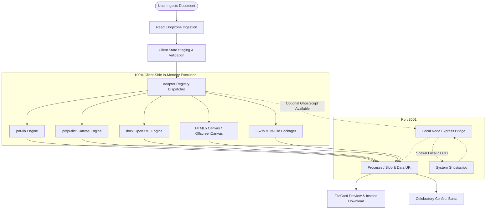

<p align="center">
  
</p>

<h1 align="center">ILoveMyOfficeWorks</h1>

<p align="center">
  <strong>The 100% Private, Client-Side PDF & Office Productivity Suite</strong><br>
  A modern, high-performance web application engineered with React 18, Vite, Tailwind CSS, Three.js, and in-browser WebAssembly document engines.
</p>

<p align="center">
  
  
  
  
  
  
  
</p>

---

## 📑 Table of Contents

- [🌟 Overview \& Core Philosophy](#-overview--core-philosophy)
- [✨ Key Features](#-key-features)
- [🛠️ Technology Stack](#️-technology-stack)
- [🎨 UI \& Design System (Luxury Sage)](#-ui--design-system-luxury-sage)
- [🗂️ Complete Tool Catalog (35 Tools / 7 Suites)](#️-complete-tool-catalog-35-tools--7-suites)
- [🖼️ High-Capacity 1,000+ Image Merger Engine](#️-high-capacity-1000-image-merger-engine)
- [🏗️ System Architecture](#️-system-architecture)
- [📂 Repository \& File Structure](#-repository--file-structure)
- [🧩 Pluggable Tool Adapter Pattern](#-pluggable-tool-adapter-pattern)
- [🚀 Quick Start \& Installation](#-quick-start--installation)
- [🪟 Windows Desktop Application (Electron.js)](#-windows-desktop-application-electronjs)
- [⚙️ Optional Localhost Server (Ghostscript)](#️-optional-localhost-server-ghostscript)
- [🧪 Automated Testing & Verification](#-automated-testing--verification)
- [📚 Documentation Index](#-documentation-index)
- [📄 License](#-license)

---

## 🌟 Overview & Core Philosophy

Most online PDF tools (e.g., iLovePDF, Smallpdf) require users to upload sensitive files—financial records, legal contracts, identification scans—to remote cloud servers. This introduces data privacy risks, bandwidth bottlenecks, and potential regulatory non-compliance.

**ILoveMyOfficeWorks** was built to solve this problem permanently:

1. **🛡️ 100% Private & Zero Cloud Transmission**: Every document manipulation runs **entirely in your browser memory**. Bytes, pixels, and OCR text never leave your machine.
2. **⚡ Blazing Fast Local Processing**: Native WebAssembly, OffscreenCanvas downsampling, and modern JavaScript engines deliver instant results without network upload or download latency.
3. **🎨 Luxury Modern Aesthetics**: Crafted using a curated **Luxury Sage** and **Warm Cream** design system, interactive 3D particle physics via Three.js, fluid Framer Motion animations, and zero-line-break responsive navigation.
4. **🔌 Modular Adapter Architecture**: All 35 tools follow a unified, pluggable adapter contract, making the codebase extensible and clean.

---

## ✨ Key Features

- **35 Production-Grade Tools**: Full coverage across PDF organization, optimization, conversion, editing, security, and high-resolution image processing.
- **High-Capacity 1,000+ Image Merger**: Merge hundreds or thousands of photos into a single consolidated PDF or stitched continuous photo strip with zero browser memory exhaustion.
- **True In-Browser PDF to DOCX**: Extracts text coordinates, font styles, and paragraphs using `pdfjs-dist` and generates native Microsoft Word `.docx` documents via OpenXML.
- **4-Tier Intelligent Compression**: Features Extreme, Recommended, Light, and Custom downsampling modes with HTML5 Canvas downscaling and PDF object stream deduplication.
- **Ambient 3D Visuals**: Interactive background powered by `Three.js` that reacts gently to mouse velocity and window scrolling.
- **Diagnostic Splash Screen**: Real-time diagnostic boot sequence that verifies WebAssembly buffers, engine adapters, and privacy shields, with an immediate fallback pre-React loader in `index.html`.
- **Drag-and-Drop Staging Workspace**: Intuitive file card management, 30-item windowed pagination for large queues, reordering (move up/down), A-Z/Z-A sorting, real-time file size calculations, multi-file batch downloads, and celebratory confetti.

---

## 🛠️ Technology Stack

| Layer | Technology | Purpose & Implementation |
| :--- | :--- | :--- |
| **Frontend Framework** | **React 18** | Declarative component hierarchy, hooks, state management |
| **Build Tooling** | **Vite 6** | ESM-based lightning-fast HMR and Rollup-optimized production builds |
| **Styling & Tokens** | **Tailwind CSS 3.4** | Utility-first CSS, custom CSS tokens, modern glassmorphism |
| **3D Graphics** | **Three.js** | Interactive background particle field with mouse tracking |
| **Motion & Physics** | **Framer Motion 14** | Layout animations, accordion transitions, diagnostic boot loaders |
| **Celebrations** | **canvas-confetti** | High-performance confetti burst upon successful document generation |
| **PDF Manipulation** | **pdf-lib (v1.17)** | Page manipulation, merging, splitting, rotation, watermarking, forms |
| **PDF Rendering & OCR** | **pdfjs-dist (v6.4)** | Web Worker page rasterization, text layout analysis, canvas previews |
| **Word Generation** | **docx (v9.9)** | Client-side OpenXML `.docx` generator with styling, paragraphs, tables |
| **Archive Packaging** | **jszip (v3.10)** | Multi-file ZIP bundling for batch extractions and conversions |
| **File Staging** | **react-dropzone** | Accessible drag-and-drop file ingestion with MIME validation |
| **Icons** | **Lucide React** | Consistent, modern vector iconography across all 35 tools |
| **Backend (Optional)** | **Node.js + Express** | Optional localhost helper on port 3001 for native Ghostscript CLI |

---

## 🎨 UI & Design System (Luxury Sage)

The user interface adheres to a strict luxury design system inspired by organic botanical tones and editorial stationery:

```
┌────────────────────────────────────────────────────────────────────────┐
│                        LUXURY SAGE PALETTE                             │
├───────────────────┬───────────┬────────────────────────────────────────┤
│ Deep Sage Primary │ #5B7147   │ Brand accent, active states, buttons   │
│ Forest Dark       │ #435433   │ High-contrast headers, button hovers   │
│ Warm Cream        │ #FAF8F4   │ Primary page background canvas         │
│ Deep Charcoal Text│ #1E2619   │ High-legibility typography             │
│ Champagne Border  │ #E8E1D5   │ Card borders, subtle divider lines     │
│ Sand Accent       │ #DDD3C2   │ Dropdown containers, active borders    │
└───────────────────┴───────────┴────────────────────────────────────────┘
```

- **Zero-Line-Wrap Rule**: All navigation items, tool badges, and dropdown triggers utilize `whitespace-nowrap` to prevent unsightly multi-line wrapping across screen widths.
- **Glassmorphism**: Translucent floating surfaces with `backdrop-blur-xl` and subtle box shadows (`shadow-stone-900/5`).
- **Typography**: 
  - **Plus Jakarta Sans**: Primary headings, navigation labels, and hero titles.
  - **Inter**: Body descriptions and configuration labels.
  - **JetBrains Mono**: Technical metrics, byte savings, and file extension tags.

---

## 🗂️ Complete Tool Catalog (35 Tools / 7 Suites)

### 1. 🗂️ ORGANIZE PDF
| Tool ID | Name | Accepted Inputs | Key Capabilities |
| :--- | :--- | :--- | :--- |
| `merge-pdf` | **Merge PDF** | Multiple PDFs | Combine unlimited PDFs in arbitrary order with drag-and-drop sequence |
| `split-pdf` | **Split PDF** | Single PDF | Slice into individual pages, fixed page intervals, or custom ranges (`1-3, 5, 8-10`) |
| `remove-pages` | **Remove Pages** | Single PDF | Strip unwanted, blank, or duplicate pages by comma-separated index |
| `extract-pages` | **Extract Pages** | Single PDF | Pick and bundle specific page ranges into an isolated new PDF |
| `organize-pdf` | **Organize PDF** | Single PDF | Reorder, reverse, or duplicate pages with customizable page sequences |
| `scan-to-pdf` | **Scan to PDF** | Photos / Images | Clean up photos with auto-contrast, grayscale, and document cropping |

### 2. ⚡ OPTIMIZE PDF
| Tool ID | Name | Accepted Inputs | Key Capabilities |
| :--- | :--- | :--- | :--- |
| `compress-pdf` | **Compress PDF** | Single PDF | 4 compression profiles, canvas downsampling, metadata purging, Ghostscript bridge |
| `repair-pdf` | **Repair PDF** | Damaged PDF | Recover corrupted xref tables, rebuild broken trailer dictionaries, and salvage streams |
| `ocr-pdf` | **OCR PDF** | Scanned PDF | Extract text layers from scanned pages and generate searchable PDFs and TXT files |

### 3. 📥 CONVERT TO PDF
| Tool ID | Name | Accepted Inputs | Key Capabilities |
| :--- | :--- | :--- | :--- |
| `jpg-to-pdf` | **JPG to PDF** | JPG, PNG, WebP | Multi-image compilation with orientation control (Portrait/Landscape) and margins |
| `word-to-pdf` | **WORD to PDF** | Word (`.docx`) | Convert Word OpenXML documents into formatted PDF vector sheets |
| `powerpoint-to-pdf` | **PowerPoint to PDF** | Presentation (`.pptx`) | Convert PowerPoint slides into landscape presentation PDFs |
| `excel-to-pdf` | **Excel to PDF** | Spreadsheets (`.xlsx`, `.csv`) | Render structured data tables into styled vector PDF pages |
| `html-to-pdf` | **HTML to PDF** | HTML, Webpages | Render HTML markup, CSS styling, and web articles into printable PDFs |

### 4. 📤 CONVERT FROM PDF
| Tool ID | Name | Accepted Inputs | Key Capabilities |
| :--- | :--- | :--- | :--- |
| `pdf-to-jpg` | **PDF to JPG** | Single PDF | Render PDF pages to high-res JPG or PNG images; downloads individual or ZIP |
| `pdf-to-docx` | **PDF to WORD** | Single PDF | Client-side text parsing into editable Microsoft Word (`.docx`) with typography |
| `pdf-to-powerpoint` | **PDF to PowerPoint** | Single PDF | Convert presentation PDFs into 16:9 editable PowerPoint slides (`.pptx`) |
| `pdf-to-excel` | **PDF to Excel** | Single PDF | Detect numeric matrices and tabular data; export clean CSV / Excel sheets |
| `pdf-to-pdfa` | **PDF to PDF/A** | Single PDF | Convert into ISO 19005-1 compliant PDF/A archival format with embedded fonts |

### 5. ✍️ EDIT PDF
| Tool ID | Name | Accepted Inputs | Key Capabilities |
| :--- | :--- | :--- | :--- |
| `rotate-pdf` | **Rotate PDF** | Single PDF | Rotate all or selected pages by 90°, 180°, or 270° with thumbnail preview |
| `add-page-numbers` | **Add Page Numbers** | Single PDF | Insert page numbers with custom position (Header/Footer), format, and fonts |
| `add-watermark` | **Add Watermark** | Single PDF | Stamp custom text watermarks with opacity, angle, and size control |
| `crop-pdf` | **Crop PDF** | Single PDF | Trim margins, crop page dimensions, and remove white borders |
| `edit-pdf` | **Edit PDF** | Single PDF | Add custom text annotations, headers, stamps, and notes directly onto pages |
| `pdf-forms` | **PDF Forms** | Single PDF | Flatten interactive form fields into static vector elements or lock inputs to read-only |

### 6. 🛡️ PDF SECURITY
| Tool ID | Name | Accepted Inputs | Key Capabilities |
| :--- | :--- | :--- | :--- |
| `unlock-pdf` | **Unlock PDF** | Encrypted PDF | Decrypt password-protected documents and strip printing/copying restrictions |
| `protect-pdf` | **Protect PDF** | Single PDF | Encrypt documents with standard AES password protection |
| `sign-pdf` | **Sign PDF** | Single PDF | Place electronic signature badges, verification seals, and signing dates |
| `redact-pdf` | **Redact PDF** | Single PDF | Permanently blackout sensitive keywords, numbers, or rectangular areas |
| `compare-pdf` | **Compare PDF** | Two PDFs | Compare two PDF versions side-by-side with visual text diff metrics |

### 7. 🖼️ IMAGE TOOLS
| Tool ID | Name | Accepted Inputs | Key Capabilities |
| :--- | :--- | :--- | :--- |
| `merge-images` | **Merge Images** | Multiple Images (1,000+) | Combine unlimited images into a single PDF document or stitched continuous photo strip (vertical, horizontal, grid) |
| `compress-image` | **Compress Image** | JPG, PNG, WebP | Shrink image file size with smart quality sliders and dimension preservation |
| `resize-image` | **Resize Image** | Any Image | Scale images by percentage or custom width/height with aspect-ratio locking |
| `crop-image` | **Crop Image** | Any Image | Crop images with preset aspect ratios (1:1, 16:9, 4:3) or custom pixel margins |
| `convert-to-jpg` | **Convert to JPG** | PNG, WebP, SVG, BMP | Transcode arbitrary image formats into standard, universal JPEG files |

---

## 🖼️ High-Capacity 1,000+ Image Merger Engine

The **Image Merger (`merge-images`)** tool is built from the ground up for massive batch workflows without performance degradation:

- **1,000+ Images Without Limits**: Engineered with lazy buffer inspection in `pdf-magic.js`—raw binary arrays are read on-demand during conversion rather than held simultaneously in React state, maintaining near-zero browser memory pressure.
- **Two Flexible Output Modes**:
  1. **Single Consolidated PDF Document**: Stream-compiled page by page with `pdf-lib` and object streams. Yields execution every 5 images (`setTimeout(0)`) so the UI maintains 60 FPS while reporting live conversion progress.
  2. **Single Continuous Stitched Image**: Combines photos into a single continuous visual:
     - **Vertical Strip**: Sequentially stacked photos.
     - **Horizontal Strip**: Side-by-side panoramic layout.
     - **Grid Collage**: Multi-column mosaic (2–10 columns or automatic square matrix) with canvas dimension safety guards (capping at 16,384 px max dimension).
- **Non-Blocking Uploader**: Processes multi-thousand file drops in batches of 50 with live feedback (`"Loading 450 of 1,200 files..."`).
- **High-Capacity Queue Controls**: 30-item windowed pagination, alphabetical sorting (**A-Z / Z-A**), and **Reverse Order** buttons.

---

## 🏗️ System Architecture



---

## 📂 Repository & File Structure

```
ILoveMyOfficeWorks/
├── AGENTS.md                          # Comprehensive guide for AI Agents
├── README.md                          # Human developer & user documentation (You are here)
├── package.json                       # Monorepo root scripts & dev runners
├── .gitignore                         # Git exclusion rules
├── .agents/                           # Agent skills and project rules
│   ├── rules/
│   │   └── project_guidelines.md      # Strict guidelines for AI contributors
│   └── skills/
│       └── ilovemyofficeworks-toolkit/
│           └── SKILL.md               # Antigravity skill cheatsheet
├── docs/
│   └── project-knowledge/             # Architectural knowledge base
│       ├── README.md                  # Knowledge index
│       ├── 01-architecture-and-philosophy.md
│       ├── 02-tools-and-engines.md
│       ├── 03-adapter-specification.md
│       └── 04-ui-and-design-system.md
├── client/                            # React 18 + Vite Frontend Application
│   ├── index.html                     # HTML shell + inline zero-flash pre-React splash
│   ├── package.json                   # Client dependencies (pdf-lib, docx, framer-motion)
│   ├── vite.config.js                 # Vite bundler configuration
│   ├── tailwind.config.js             # Tailwind CSS tokens & theme configuration
│   ├── postcss.config.js              # PostCSS plugins
│   ├── public/
│   │   ├── logo.png                   # Official high-resolution brand logo
│   │   └── favicon.png                # Browser tab icon
│   └── src/
│       ├── main.jsx                   # React root entry point
│       ├── App.jsx                    # Root application state & tool routing
│       ├── index.css                  # Tailored design tokens, typography, scrollbars
│       ├── components/                # Modular UI components
│       │   ├── Navbar.jsx             # Zero-wrap navigation bar & category dropdowns
│       │   ├── HomeScreen.jsx         # Home hero banner, category grid & search filter
│       │   ├── SplashScreen.jsx       # Diagnostic startup splash screen & progress bar
│       │   ├── ThreeCanvas.jsx        # Interactive 3D particle background (Three.js)
│       │   ├── Uploader.jsx           # Drag-and-drop file ingestion zone
│       │   ├── FileCard.jsx           # File queue cards with reordering controls
│       │   └── OperationBar.jsx       # Action execution trigger & progress indicator
│       ├── registry/                  # Pluggable Tool Adapter Registry
│       │   ├── registry.js            # Central adapter loader & dispatcher
│       │   └── adapters/              # 35 Pluggable Tool Adapters
│       │       ├── merge-pdf.js
│       │       ├── split-pdf.js
│       │       ├── compress-pdf.js
│       │       ├── pdf-to-docx.js
│       │       ├── merge-images.js        # 1,000+ Image Merger engine
│       │       ├── protect-pdf.js
│       │       └── ... (35 adapters)
│       └── utils/                     # Core computational engines
│           ├── pdf-compressor-engine.js  # Canvas downsampler + object stream cleaner
│           ├── pdf-to-docx-engine.js    # PDF.js to Word OpenXML converter
│           └── pdf-magic.js             # Encryption detector & metadata inspector
├── desktop/                           # Windows Desktop Application (Electron.js)
│   ├── assets/                        # Windows .ico and .png app icons
│   ├── main.cjs                       # Electron main process (frameless window, IPC, dialogs)
│   ├── preload.cjs                    # Secure contextBridge API for desktop features
│   ├── electron-builder.json          # Windows installer (NSIS) and portable config
│   ├── package.json                   # Desktop scripts & Electron dependencies
│   └── README.md                      # Desktop setup and build guide
└── server/                            # Optional Localhost Helper (Port 3001)
    └── server.js                      # Localhost Ghostscript bridge (optional)
```

---

## 🧩 Pluggable Tool Adapter Pattern

Every operation in **ILoveMyOfficeWorks** implements the **Standard Tool Adapter Contract**:

```javascript
// client/src/registry/adapters/example-tool.js

export default {
  // 1. Unique string identifier
  id: 'example-tool',

  // 2. User-facing display name and metadata
  name: 'Example Tool',
  description: 'Concise explanation of what this tool accomplishes.',
  badge: 'Category',

  // 3. Validation rule for uploaded files
  accepts(files) {
    if (!files || files.length === 0) {
      return { valid: false, reason: 'Please upload at least one file.' };
    }
    const allPdf = files.every((f) => f.name.toLowerCase().endsWith('.pdf'));
    return { valid: allPdf, reason: allPdf ? '' : 'All files must be PDFs.' };
  },

  // 4. Configurable tool options (rendered automatically in OperationBar)
  options: [
    {
      id: 'mode',
      label: 'Operation Mode',
      type: 'select',
      defaultValue: 'standard',
      choices: [
        { label: 'Standard Mode', value: 'standard' },
        { label: 'High Fidelity', value: 'high' },
      ],
    },
  ],

  // 5. Execution engine (100% client-side)
  async execute(files, options, onProgress) {
    onProgress?.(25, 'Reading file buffers...');
    // ... document processing logic ...
    onProgress?.(100, 'Complete!');

    return {
      success: true,
      files: [
        {
          name: 'output-document.pdf',
          blob: new Blob([...], { type: 'application/pdf' }),
          type: 'application/pdf',
        },
      ],
    };
  },
};
```

All adapters are loaded and registered in [client/src/registry/registry.js](file:///d:/ILoveMyOfficeWorks/client/src/registry/registry.js).

---

## 🚀 Quick Start & Installation

### Prerequisites
- **Node.js**: v18.0.0 or higher
- **npm**: v9.0.0 or higher

### 1. Clone & Install
```bash
# Clone the repository
git clone https://github.com/Anshumaankhare2403/ILoveMyOfficeWorks.git
cd ILoveMyOfficeWorks

# Install root, client, and server dependencies
npm install
npm install --prefix client
npm install --prefix server
```

### 2. Start Development Environment
```bash
# Starts both the React client (Port 5173) and local server (Port 3001) concurrently
npm run dev
```
Open your browser and navigate to: **`http://localhost:5173/`**

### 3. Build for Production
```bash
# Compile and bundle the client into static assets
npm run build --prefix client
```
The optimized production bundle will be output to `client/dist/`.

---

## 🪟 Windows Desktop Application (Electron.js)

The project includes a dedicated `desktop/` workspace containing the full **Electron.js Windows Desktop Edition (v2.5.0)**:

### 1. Run Desktop in Development Mode (Live HMR)
Runs the Vite development server with hot-module reloading and attaches Electron:
```bash
npm run desktop:dev
```

### 2. Run Desktop Production Build Locally
Tests the desktop application against the compiled static client bundle:
```bash
npm run desktop:start
```

### 3. Package Windows Executables (.exe)
Compiles the client and packages the standalone Windows portable executable with embedded multi-resolution brand icon:
```bash
# From project root:
npm run desktop:build

# Or use the shorthand alias from root:
npm run desktop:make

# Or directly inside the desktop directory:
cd desktop
npm run make
```

Output files will be saved in [`desktop/dist-electron/`](file:///d:/ILoveMyOfficeWorks/desktop/dist-electron/):
- **`ILoveMyOfficeWorks-Windows-Portable-2.5.0.exe`** (~73.6 MB) — **Single-File Portable Executable.** Runs immediately on any Windows 10/11 computer without installation or admin rights.
- **`win-unpacked/ILoveMyOfficeWorks.exe`** — Unpacked portable folder distribution.

### 🖼️ True Multi-Resolution Windows Application Icon (`icon.ico`)
The executable embeds a high-DPI Windows icon containing **7 mipmap resolutions**:
- **16 × 16, 24 × 24, 32 × 32, 48 × 48, 64 × 64** (Uncompressed BMP/DIB for title bars, taskbars, and standard DPI shortcuts)
- **128 × 128, 256 × 256** (PNG-compressed for Large / Extra Large File Explorer views and High-DPI 4K monitors)

This guarantees the Luxury Sage brand logo renders crisply with zero blur or generic Electron fallbacks.

### 🌟 Desktop-Exclusive Windows Features:
- **Luxury Sage Frameless Title Bar**: Seamlessly matches `#FAF8F4` and `#5B7147` tokens with native minimize, maximize/restore, and close buttons, plus smooth multi-monitor window dragging.
- **Windows File Associations (`.pdf`)**: Double-clicking any `.pdf` in File Explorer automatically opens it in ILoveMyOfficeWorks.
- **Native File Dialogs**: Native Windows Save / Open file dialogs.
- **Direct Save & Explorer Reveal**: Save directly to disk and reveal in Windows File Explorer (`shell.showItemInFolder`) with one click.
- **100% Offline Privacy**: Zero outbound network requests—safe for air-gapped corporate and legal environments.

### 🛡️ Windows SmartScreen Note
On first launch, Windows SmartScreen may show an *"Unrecognized app"* notice because the executable is self-distributed rather than signed with a commercial certificate. Simply click **"More info"** → **"Run anyway"** to launch.

---

## ⚙️ Optional Localhost Server (Ghostscript)

While **all 35 tools run 100% in the browser** without any server required, the optional local Node backend (`server/server.js`) can leverage system-installed **Ghostscript** for industrial-grade compression if available:

- Runs on **`http://localhost:3001`**.
- Automatically checks for `gs`, `gswin64c`, or `gswin32c`.
- If Ghostscript is not detected or the server is stopped, the client **automatically falls back to pure in-browser canvas and object-stream compression**.

---

## 🧪 Automated Testing & Verification

The codebase includes an automated test suite executed with Node.js's native test runner (`node --test`):

```bash
# Run the complete test suite (39 automated unit & privacy tests)
npm test
```

### What the Test Suite Verifies:
1. **Security & Privacy Audit Tests**:
   - Asserts that none of the 35 tool adapters contain external HTTP/HTTPS network calls, ensuring 100% client-side privacy.
   - Validates that server Ghostscript command execution is protected against shell injection vulnerabilities.
   - Audits redaction adapters for true stream-level data removal vs cosmetic overlays.
2. **Adapter Registry Architecture & Contract Compliance**:
   - Verifies all 35 adapters have unique IDs, adhere to the adapter specification contract (`accepts`, `options`, `execute`), and handle empty/invalid inputs gracefully.
   - Validates password-protected PDF rejection logic and dynamic validation evaluation.
3. **Tool Adapter Operations Execution**:
   - Tests core document operations: merging, splitting by range, deleting pages, extraction, rotation, watermarking, page numbers, form flattening, ISO PDF/A metadata embedding, and cryptographic signing badges.
   - Robustness tests for Unicode, emojis, and typographic characters.
4. **Backend Server API & Ghostscript Bridge**:
   - Tests server health endpoints, fallback responses (HTTP 503) when Ghostscript is unavailable, and temporary file cleanup.
5. **PDF Magic Utilities & File Inspector**:
   - Tests byte inspection, `%PDF-` header validation, 200MB file size limits, and image/Office file format detection.

---

## 📚 Documentation Index

For technical deep-dives and AI Agent instructions, refer to:

- [AGENTS.md](file:///d:/ILoveMyOfficeWorks/AGENTS.md) — Quick orientation for AI pair programmers.
- [docs/project-knowledge/01-architecture-and-philosophy.md](file:///d:/ILoveMyOfficeWorks/docs/project-knowledge/01-architecture-and-philosophy.md) — Zero-cloud privacy model.
- [docs/project-knowledge/02-tools-and-engines.md](file:///d:/ILoveMyOfficeWorks/docs/project-knowledge/02-tools-and-engines.md) — Comprehensive engine mechanics.
- [docs/project-knowledge/03-adapter-specification.md](file:///d:/ILoveMyOfficeWorks/docs/project-knowledge/03-adapter-specification.md) — Adapter interface contract.
- [docs/project-knowledge/04-ui-and-design-system.md](file:///d:/ILoveMyOfficeWorks/docs/project-knowledge/04-ui-and-design-system.md) — UI tokens & design rules.

---

## 📄 License

Distributed under the **MIT License**. Free for personal and commercial usage.

---

<p align="center">
  Crafted with care for complete document privacy & productivity 🌿📄
</p>
