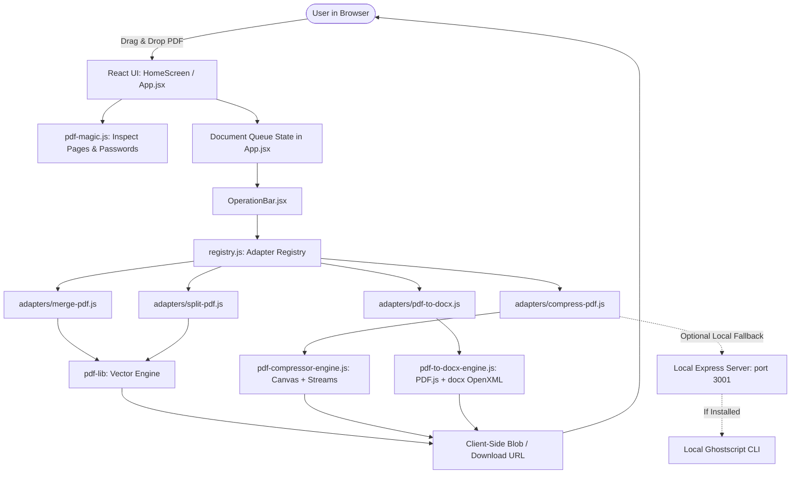

# 01 — Architecture & Core Philosophy

## 1. Core Mission: 100% Client-Side Privacy

The foundational premise of **ILoveMyOfficeWorks** is total data privacy. Most commercial PDF toolkits (e.g. Smallpdf, iLovePDF, Adobe Online) require users to upload confidential contracts, financial statements, and medical records to remote cloud servers.

In **ILoveMyOfficeWorks**:
- **Zero Cloud Data Transmission**: All file parsing, vector geometry manipulation, image downsampling, and document generation occur **exclusively within the user's browser runtime memory**.
- **Ephemeral Processing**: File bytes exist only in JavaScript `Uint8Array` / `ArrayBuffer` objects and are discarded as soon as the session closes or the user clears the queue.
- **Localhost Independence**: The web application functions completely offline without an active internet connection once the assets are cached.

---

## 2. High-Level System Architecture

---

## 3. Technology Stack & Ecosystem

| Layer | Technology | Purpose |
| :--- | :--- | :--- |
| **Frontend Framework** | **React 18 + Vite** | High-performance SPA with instant HMR and optimized tree-shaking |
| **Styling** | **Tailwind CSS + Vanilla CSS** | Custom design tokens, glassmorphism, responsive utilities |
| **Typography** | **Plus Jakarta Sans + JetBrains Mono** | Modern, premium editorial SaaS aesthetic |
| **Motion & Dynamics** | **Framer Motion** | Layout transitions, tab pills, queue reordering animations |
| **3D Background** | **Three.js** | Ambient interactive particle web rendering in the background |
| **PDF Manipulation** | **`pdf-lib`** | Pure JS PDF document builder, merger, page splitter, object serializer |
| **PDF Parsing** | **`pdfjs-dist` (Mozilla PDF.js)** | WebWorker-driven vector text coordinate extraction and page rendering |
| **DOCX Generation** | **`docx` (OpenXML)** | Client-side Microsoft Word document builder with XML serialization |
| **Local Bridge** | **Node.js Express (Optional)** | Optional localhost service on port 3001 for native Ghostscript access |

---

## 4. The Role of the Local Server (`server/server.js`)

The Node.js server (`server/`) is **strictly optional**:
1. It listens on `http://localhost:3001`.
2. It detects if Ghostscript (`gswin64c`, `gswin32c`, `gs`) is installed on the user's local operating system.
3. If Ghostscript is present and the user opts to compress via Ghostscript, the client sends a `POST /api/compress` to `localhost:3001`.
4. **Graceful Fallback**: If the server is offline or Ghostscript is not installed, the client-side master compression pipeline automatically falls back to in-browser Canvas downsampling and stream rebuilding without failing.
